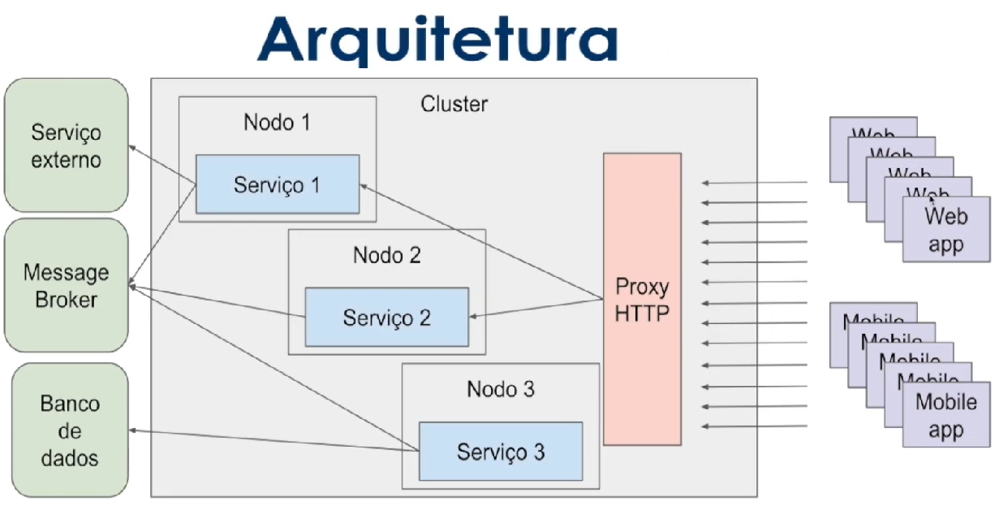
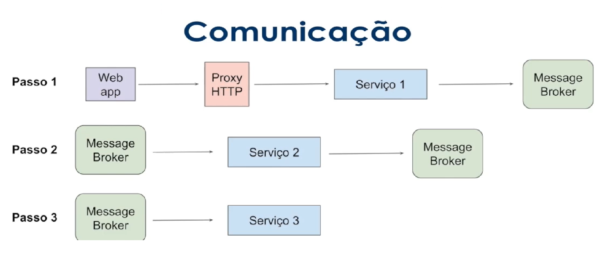
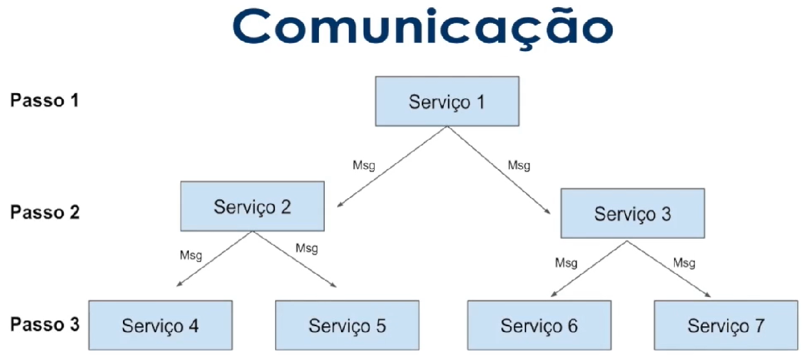
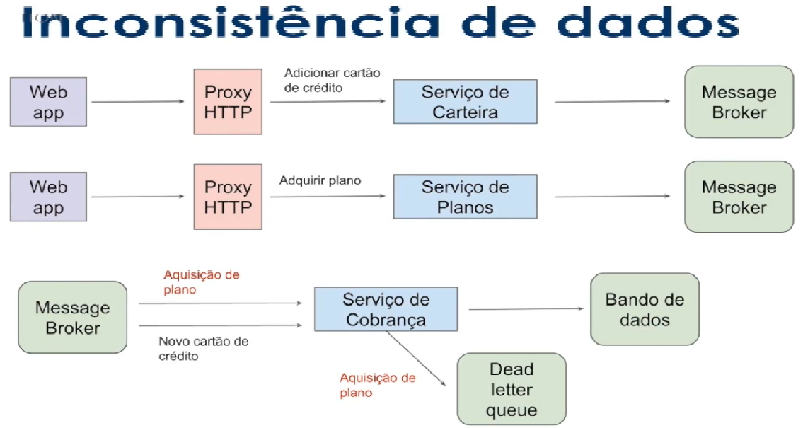
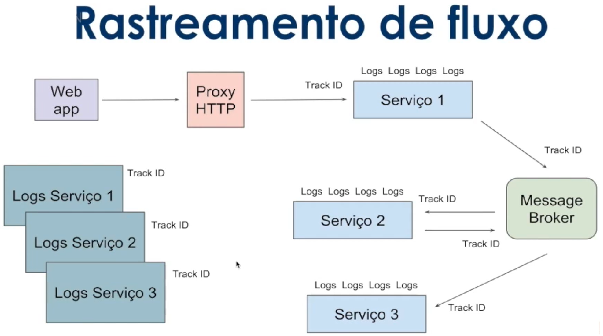

# Arquitetura de mensageria

## Exemplo de modelo de arquitetura de mensageria

Pros:
<li>Desacoplamento
<li>Facil plug & play
<li>Comunicação assíncrona
<li>Simples escalabilidade
<li>Broadcasting
<li>Permite Event Source

Cons:

<li>Simple point of failure
<li>Difícil monitoramento 
 

## Comunicação Assíncrona

Pode ser simples e linerar como o modelo abaixo com o uso do Kafka(message broker), em que se torna fácil monitorar e rastrear possíveis bad requests.

 Ou pode ser mais complexa de forma não linear, uma vez que os serviços não conseguem rastrear de onde vem o erro, tornando assim, o monitoramento mais complexo. Exemplificado na imagem abaixo.

## Gerenciamento de erros
<li>Dead letter queue (Filas de re-tentativas);
<li>Monitoramento entre serviços;
<li>Rastreamento de fluxos;

### Inconsistências de dados

Querer guardar uma informação que depende de outra informação que ainda não se tem. Exemplo: guardar um cartão de crédito que dependete de um usuário que ainda não está cadastrado. Os eventos na dead letter queue podem ser observados pelos devs e corrigidos manualmente.
 

### Rastreamento de fluxo
Como fazer o rastreamento? Como entender o que tá acontecendo? O que gerou tal erro?

 Com o uso de Track ID é possível rastrear de onde surgiu o request, quando e onde foi originado o serviço.

Primeiramente ocorre o request, o Serviço 1 gera logs e passa para o message broker, o Serviço 2 gera novos logos e também repassa para o message broker, bem como o Serviço 3.

Para que a origem dos logs sejam identificadas, deve-se agrupa-los e indexa-los de maneira centralizada, por tempo, tipo, request e serviço.
