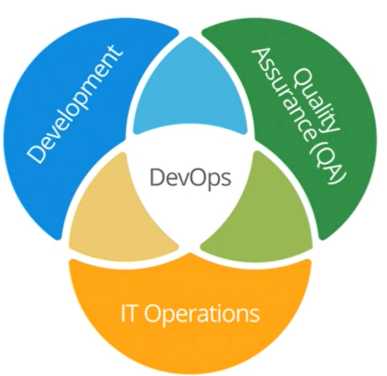
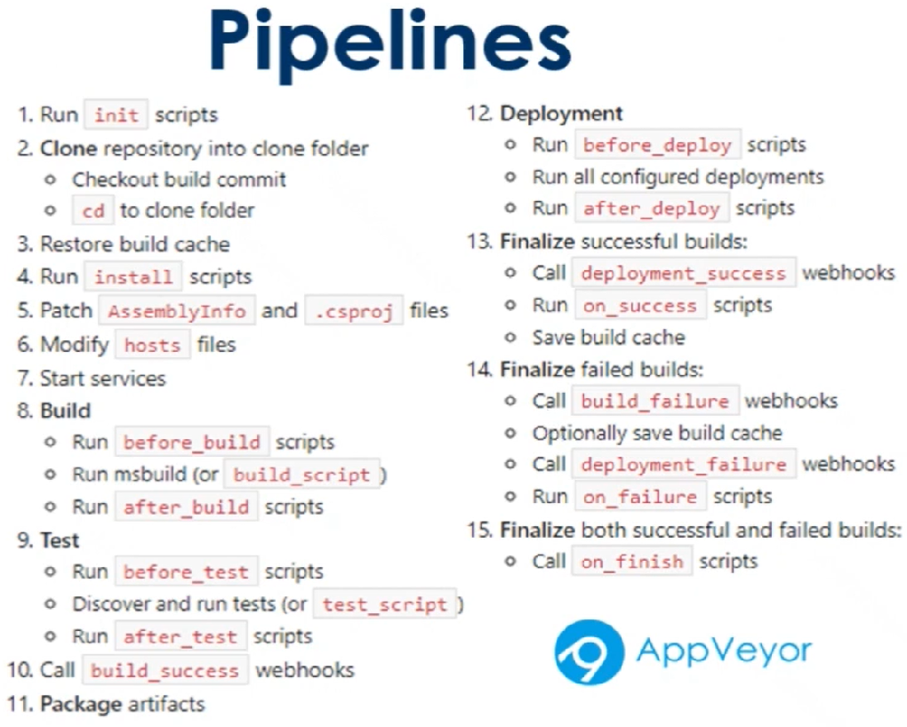

# DevOps

A metodologia DevOps é uma abordagem de cultura, automação e design de plataforma que tem como objetivo agregar mais valor aos negócios e aumentar sua capacidade de resposta às mudanças por meio de entregas de serviços rápidas e de alta qualidade. Tudo isso é possível por meio da disponibilização de serviços de TI rápidos e iterativos. Adotar o DevOps significa conectar aplicações legadas a uma infraestrutura e aplicações modernas e nativas em nuvem.

A palavra "DevOps" é a combinação dos termos "desenvolvimento" e "operações". No entanto, ela representa um conjunto de ideias e práticas que ultrapassam o significado desses dois termos.

## Framework CALMS

<b>C</b>ulture - Todas as ferramentas e automações são inúteis se não forem acompanhadas pela verdadeira disposição da área de desenvolvimento e operações em trabalhar juntos.

<b>A</b>utomation - Elimina o trabalho manual repetitivo, produz processos repetíveis e cria sistemas confiáveis. Gera velocidade na entrega e tornam os envolvidos mais produtivos. Normalmente, compilar, testar, implementar e provisionar automatizados são o ponto de partida típico para equipes que ainda não tem isso implantado.

<b>L</b>ean - Precisamos focar nas entregas de valor ao cliente. Precisamos ser objetivos e enxutos. Precisamos conhecer as nossas limitações e os gargalos do processo. Precisamos ser Lean.
A mentalidade DevOps vê oportunidades de melhoria contínua em toda parte. Identificando as limitações, podemos otimizar o fluxo, entregando mais velocidade e maior eficiência.

<b>M</b>easurement - Por ser cíclico e infinito, mensurar e obter métricas é o ponto de partida para novas melhorias, seja para o processo de desenvolvimento, o software produzido ou as regras de negócio.

<b>S</b>haring - Compartilhar informações além de ser saudável, auxilia na descentralização de conhecimento em pessoas dos times, evitando que os processos se tornem dependentes. Ajuda na criação de times genéricos, com conhecimentos básicos em diversos assuntos do negócio e tecnologias. Assim, o time se torna autossustentável.

## Como os fluxos de entrega devem acontecer:

### Os três caminhos:

<li>Flow - Otimização do fluxo visa eliminar os desperdícios, gargalos no processo, transferência de responsabilidades e tempos de espera. Esse camihno é trilhado entre a demanda e a entrega em produção. A chava para este caminho é o uso de metodologias ágeis, autmozatização de processos, do desenvolvimento a release, com integração contínua e entrega contínuo.

<li>Feedback - Visam resolver problemas o quanto antes, testando tudo, alertando falhas, considerando todas métricas coletadas no ambiente produtivo sobre o valor entregado. O monitoramento é a chave, gerando informações relevantes constantemente. Feedbacks rápidos levam o negócio a falhar rápido, corrigir rapido e retomar o rumo, caso necessário.

<li>Learning - Aprendizado contínuo visa gerar conhecimento através da experimentação. Hipóteses são melhores que uma certeza imediata. Conversas atualizando melhores caminhos, práticas. O processo científico produz segurança psicológica. O trabalho dinâmico é a chave, realizar experimentos em grupo diariamente para gerar melhorias novas. Elime a cultura da culpa e aumente a colaboração e o compartilhamento de conhecimento.

## Continous Integration

CI/CD, continuous integration/continuous delivery, é um método para entregar aplicações com frequência aos clientes. Solucionar os problemas que a integração de novos códigos pode causar para as equipes de operações e desenvolvimento (o famoso “inferno de integração”).

Uma CI bem-sucedida é quando novas mudanças no código de uma aplicação são desenvolvidas, testadas e consolidadas regularmente em um repositório compartilhado. É a solução ideal para evitar conflitos entre ramificações quando muitas aplicações são desenvolvidas ao mesmo tempo.

“CD” se refere à entrega contínua e/ou à implantação contínua, conceitos relacionados e usados alternadamente às vezes. Em ambos os casos, se trata da automação de fases avançadas do pipeline, mas são usados às vezes separadamente para ilustrar o nível de automação presente.

Geralmente, a entrega contínua representa as mudanças feitas pelo desenvolvedor em uma aplicação, que são automaticamente testadas contra bugs e carregadas em um repositório, como o GitHub, ou em um registro de container. Nesse repositório, a equipe de operações pode implantar essas mudanças em um ambiente de produção ativo. Isso resolve o problema de baixa visibilidade e comunicação entre as equipes de negócios e desenvolvimento. Para isso, a finalidade da entrega contínua é garantir o mínimo de esforço na implantação de novos códigos.

A implantação contínua, outro significado para “CD”, se refere ao lançamento automático das mudanças feitas por um desenvolvedor do repositório à produção, onde podem ser usadas pelos clientes. Isso evita a sobrecarga das equipes de operações por conta dos processos manuais que atrasam a entrega de aplicações. Nesse conceito, são aproveitados os benefícios da entrega contínua ao automatizar a próxima etapa no pipeline.

Ações do Pipeline

## Code Quality Analysis - Continuous Inspection
Principais ferramentas: 
<li>Sonarqube;
<li>Code Climate;
<li>Codacy;

Funções:
<li>Analisar se o código tá ficando mais complexo - O quanto o seu código pode seguir caminhos independentes.
<li>Identificar códigos duplicados.
<li>Code smell - password anexado ao código, é uma vulnerabilidade.
<li>Identifica padrões e estilos.
<li>Cobertura de Testes.
<li>Métricas.
<li>Validando Pull-Requests.