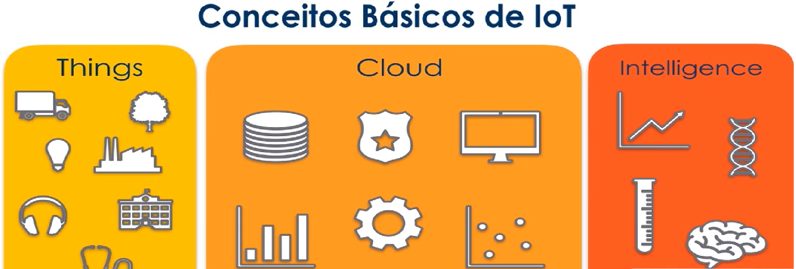
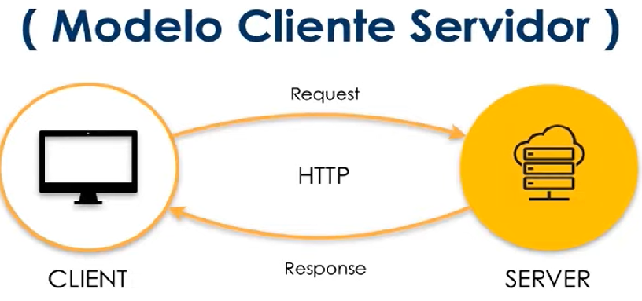
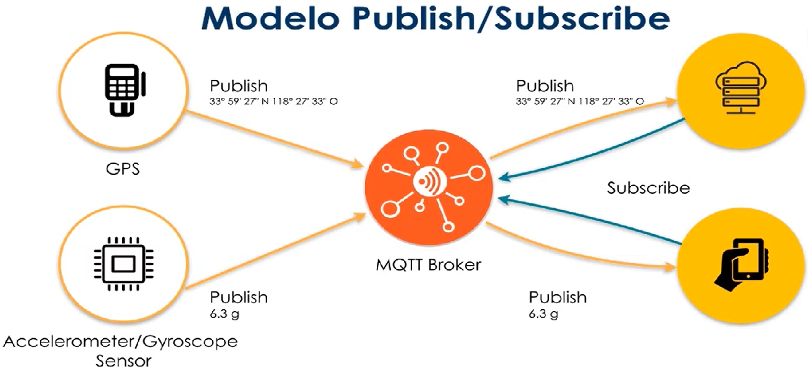
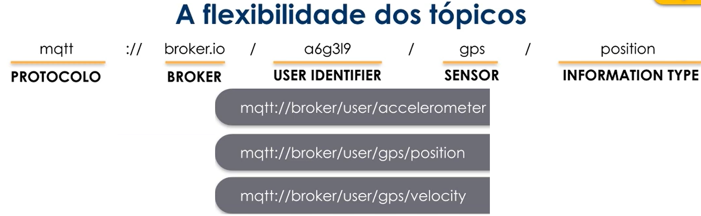

## Internet of Things - IoT
A Internet das Coisas (IoT) descreve a rede de —“objetos físicos”— incorporados a sensores, software e outras tecnologias com o objetivo de conectar e trocar dados com outros dispositivos e sistemas pela internet. Esses dispositivos variam de objetos domésticos comuns a ferramentas industriais sofisticadas. Com mais de 7 bilhões de dispositivos IoT conectados hoje, os especialistas esperam que esse número cresça para 10 bilhões em 2020 e 22 bilhões em 2025. - Oracle.

# Desafios da IoT
<ul>Privacidade e Segurança</ul>
<ul>Quantidade exponencial de dospositivos conectadas a rede</ul>
<ul>Ser capaz de processar e armazenar uma enorme quantidade de informações</ul>
<ul>Gerar valor a partir dos dados coletados</ul>

# Arquitetura das IoTs

Atributos a se considerar ao escolher um IoT device:

<li>Baixo consumo de energia;
<li>Rede de dados limitado;
<li>Resilência;
<li>Segurança;
<li>Customização;
<li>Baixo custo.

# Popular platforms:

Arduino:

<li>Plataforma de prototipagem;
<li>Com entradas e saídas;
<li>Programável em C/C++;
<li>Interface serial ou USB;
<li>Shields.

Embarcados:

MCUs

<li>Microcontrolador de chip único;
<li>Sistema Operacional real time;
<li>Embarcado;
<li>Uso industrial, médico, militar, transporte.

Microcomputadores:

Raspberry PI

<li>Computador completo
<li>Hardware integrado em uma única placa
<li>Roda SO Linux ou Windows
<li>Uso doméstico e comercial

# MQTT Protocol - Message Queuing Telemetry Transport

Mais conhecido e mais utilizado de IoT. Ligando um GPS device com Smartphone Android para se comunicar pela nuvem.

<li>Base na pilha do TCP/IP
<li>Protocolo de mensagem assíncrona (M2M - Machine to Machine)
<li>Criado pela IBM para conectar sensores de pipelines de petróleo a satélites
<li>Padrão OASIS suportado pelas linguagens de programação mais populares

# Modelo de arquitetura IoT

Modelo Cliente - Servidor:
 

 

Modelo Publisher-Subscriber:
 

 

O broker é um middleware que vai ser responsável por repassar as informações, no caso de monitoramento de localização em tempo real ele apresenta as determinadas funções:
 

 

 Uma vez lidando com serviço de mensagem através do broker, faz-se necessário adotar algum protocolo que garanta a qualidade na entrega das mensagens, para tal, usa-se o QoS.
 

<b>QoS</b>

Quality of Services:
 

<li> Nível 0:
<ul>Mais barato</ul>
<ul>Menor esforço</ul>
<ul>Sem garantia de entrega</ul>
<ul>Mensagem não é retransmitida</ul>

<li> Nível 1:
<ul>Garante que a mensagem foi entregue no mínimo uma vez ao destinatário</ul>
<ul>Mensagem pode ser retransmitidade se não houver confirmação da entrega</ul>

<li> Nível 2:
<ul>Considerado o mais caro</ul>
<ul>Garante que a mensagem foi entregue no mínimo uma vez ao destinatário</ul>
<ul>Mensagem pode ser retransmitidade se não houver confirmação da entrega</ul>
 

# Cloud

<li>Número de devices conectadores cada vez maior;
<li>TBs ou PBs de informações;
<li>Potencial de escala global;
 

<b>Líderes em serviço de cloud:</b>

<li><a href="https://aws.amazon.com/pt/">Amazon Web Services</a>
<li><a href="https://azure.microsoft.com/pt-br/">Microsoft Azure</a>
<li><a href="https://cloud.google.com/free">Google</a>