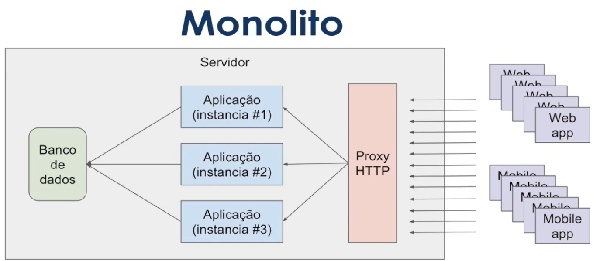
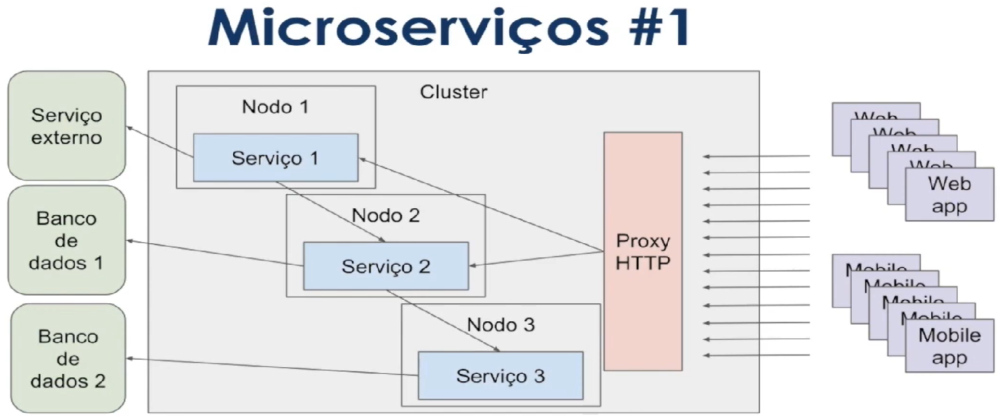
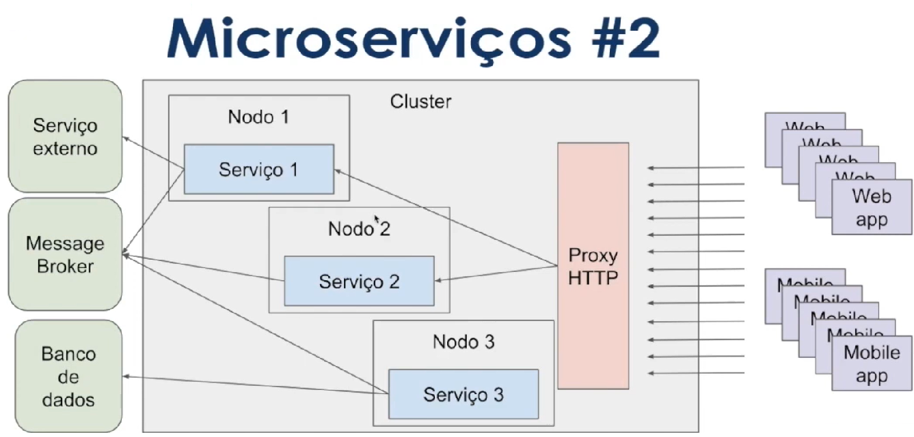
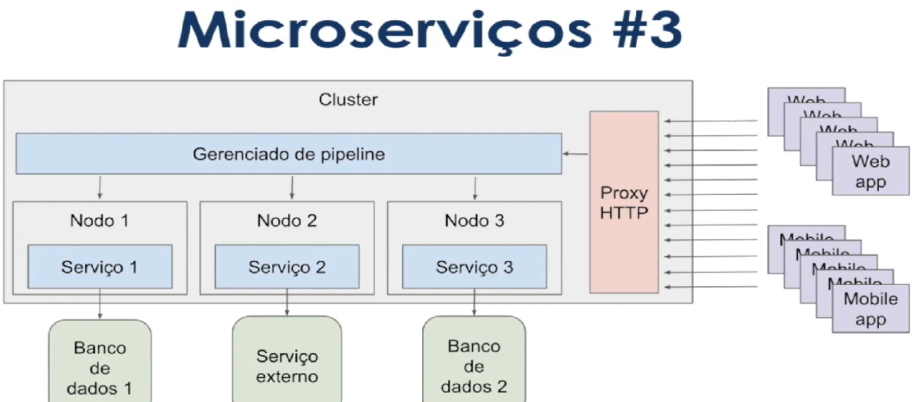

## System Architectures

# Monolito

Pros:
<li>Baixa Complexidade
<li>Monitoramento simplificado

Cons:
<li>Stack única
<li>Compartilhamento de recursos
<li>Acoplamento - sercices
<li>Escalabilidade mais complexa

# Microservice - 1

Pros:
<li>Stack dinâmica
<li>Simples escalabilidade

Cons:
<li>Acoplamento
<li>Monitoramento mais complexo 
<li>Provisionamento mais complexo
 

# Microservice - 2

Pros:
<li>Stack dinâmica
<li>Simples escalabilidade
<li>Desacoplamento

Cons:
<li>Monitoramento mais complexo 
<li>Provisionamento mais complexo

# Microservice - 3

Pros:
<li>Stack dinâmica
<li>Simples escalabilidade
<li>Desacoplamento
<li>Menor complexidade

Cons:
<li>Provisionamento mais complexo
<li>Plataforma inteira depende do gerenciador de pipeline

## Gerenciamento de erros e volume de acesso

<li>Onde é mais complexo:
- Processos assíncronos (microservice -2)
- Pipeline

<li>Solução:
-Dead Letter queue
-Filas de re-tentativas 
