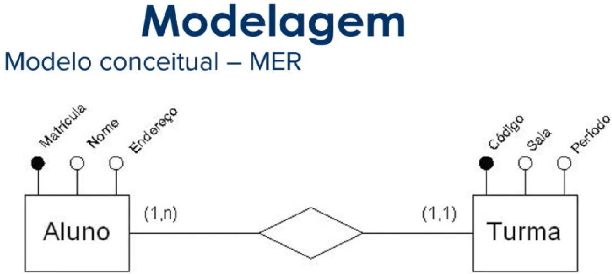

# Banco de Dados Relacionais

## SGBDR - Sistema de Gerenciamento de Banco de Dados Relacionais
Trata-se de um sistema de gerenciamento de bancos de dados baseado no modelo relacional introduzido por E. F. Codd. É responsável por analisar uma consulta SQL e escolher qual a forma mais eficiente de executá-la.

## SQL - Structured Query Language

<li>DDL - Data Definition Language ➡ CREATE, ALTER, DROP;
<li>DML - Data Manipulation Language ➡ INSERT, UPDATE, DELETE
<li>DQL - Data Query Language ➡ SELECT

<ul>Query ➡ Solicitação, código utilizado para solicitar.</ul>
<ul>Funções de Conjunto ➡ Processa um conjunto de valores contidos em uma única coluna de uma tabela.</ul>
<ul>Index ➡ São utilizados para facilitar a busca de informações em uma tabela com o menor número possível de operações de leituras, tornado assim a busca mais rápida e eficiente.</ul>
 

## Transactions
### ACID - Atomicidade, Consistência, Isolamento, Durabilidade.

Atomicidade: transação envolvendo duas ou mais partes de informações discretas, ou a transação será executada totalmente ou não será executada, garantindo assim que as transações sejam atômicas.

Consistência: A transação cria um novo estado válido dos dados ou em caso de falha retorna todos os dados ao seu estado antes que a transação foi iniciada.

Isolamento: Uma transação em andamento mas ainda não validada deve permanecer isolada de qualquer outra operação, ou seja, garantimos que a transação não será interferida por nenhuma outra transação concorrente.

Durabilidade: Dados validados são registados pelo sistema de tal forma que mesmo no caso de uma falha e/ou reinício do sistema, os dados estão disponíveis em seu estado correto.
